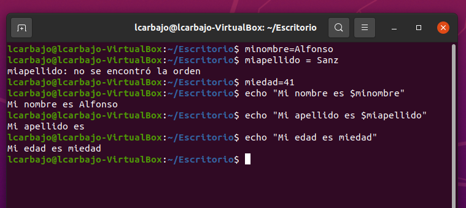
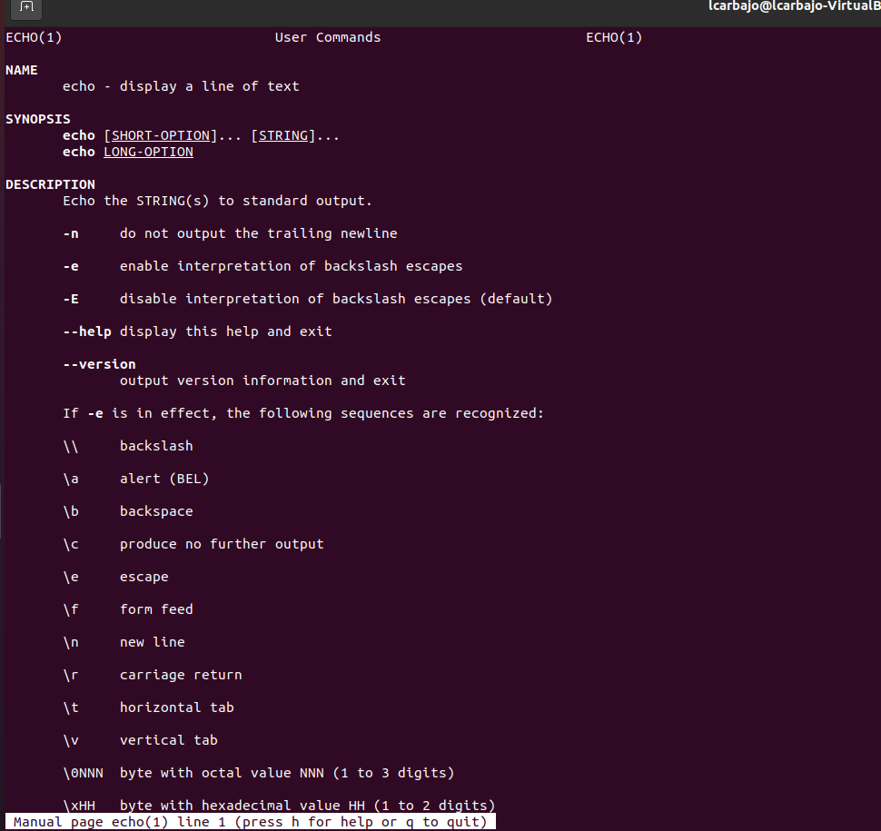
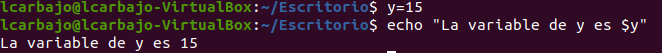
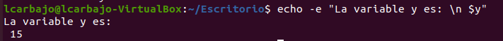
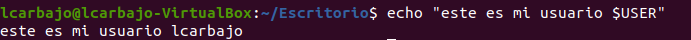
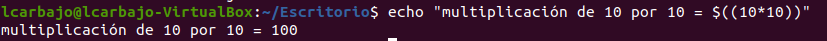
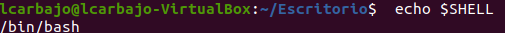
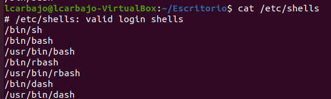

# Solución del Ejercicios 1

## 1. Encontrar Errores en Scripts
Encuentra los errores que hay en los siguientes lineas:

```bash
minombre=Alfonso
miapellido = Sanz
miedad=41
echo "Mi nombre es $minombre"
echo "Mi apellido es $miapellido"
echo "Mi edad es miedad"
```
En la ejecución nos sale:



### El script corregido sería el siguiente:
```bash
minombre=Alfonso
miapellido=Sanz
miedad=41
echo "Mi nombre es $minombre"
echo "Mi apellido es $miapellido"
echo "Mi edad es $miedad"
```

En este supuesto se encuentra dos errores:

1. En primer lugar, la variable miapellido se encuentra mal estrucutrada ya que se separa con espacios dejando un espacio tanto desde el nombre de la variable como del valor de esta respecto a `=`.
2. En segundo lugar, cuando realizamos el tercer comando echo no usamos la variable correspondiente si no un texto plano al no utilizar el `$`.


## 2. Practicar las Opciones del Comando Echo

Practica las diferentes opciones del comando `echo`.

Vamos a probar una serie de comandos:

1. Empezamos con el `man echo` que nos aporta una serie de comandos de ayuda en el que podemos usar el comando `echo`.


    

2. Un ejemplo sencillo es la creación de una variable y mostrarlo por pantalla con el comando `echo`

    

3. Usando la variable del ejemplo anterior, añadimos al comando un `-e` para así poder añadir la barra de saltos oportunas.

    

4. Podemos hacer referencia además a valores especiales como nuestro usuario, pero siempre en comillas dobles

    

5. Por último probamos a realizar una operación aritmética añadiendo las cuentas entre paréntesis.

    


## 3. Comprobar tu SHELL y Ver Shells Disponibles

Comprueba tu SHELL actual y luego verifica qué shells están disponibles en el sistema.

Para comprobar nuestro SHELL atual podemos usar el comando `echo` que hemos usado anteriormente y la variable `$SHELL`



Para verificar qué shells están disponibles usaremos el comando `cat` que permite concatenar y mostrar el contenido de archivos y le añadiremos a ruta de nuestra carpeta de shells




