# Solución del Ejercicios 2

## 1. Crear y Exportar una Variable

Vamos a crear una variable local llamada `gato` y exportarla.

Sigue estos pasos:

1. Crea una variable local llamada `gato` y asígnale el valor que quieras.

    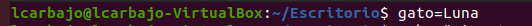

2. Muestra su valor por pantalla con el comando `echo`.

    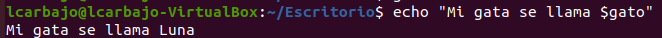

3. Mira si es una variable de entorno con el comando `env`.

    

4. Expórtala con `export`.

    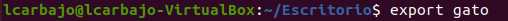

5. Comprueba de nuevo si es una variable de entorno.

    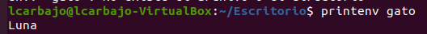

6. Borra la variable.

    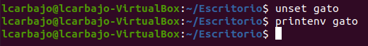

## 2. Variables de Entorno Más Usadas

Averigua qué contienen las siguientes variables de entorno más usadas:

- `HOME`: Muestra el directorio del usuario.

     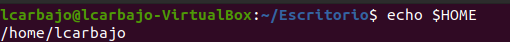

- `USER`: Muestra el usuario.

     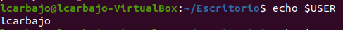

- `SHELL`: Muestra la ruta del intérprete de comandos. (shell)

     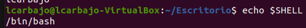

- `HOSTNAME`: Muestra el nombre del host de tu máquina.

    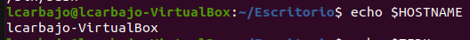

- `TERM`: Muestra el tipo de terminal que estás utilizando.

    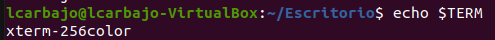

- `LOGNAME`: Muestra el nombre de usuario con el que has iniciado sesión.

    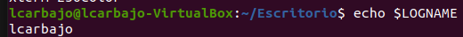

- `PATH`: Contiene una lista de directorios donde el sistema busca los ejecutables de los comandos. 

    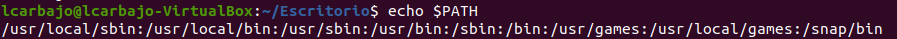

- `PWD`: Muestra la ruta del directorio de trabajo actual.

    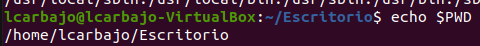

- `OLDPWD`: Guarda la ruta del directorio anterior en el que estabas antes de cambiar al directorio actual.

    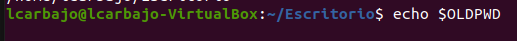

- `PS1`:  Define el prompt principal que ves en la línea de comandos.

    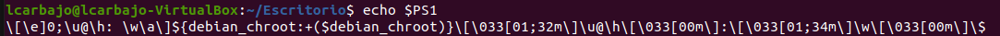

- `PS2`: Define el prompt secundario que aparece cuando una línea de comandos necesita más entrada.

    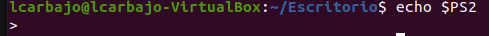