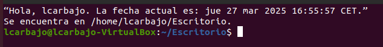
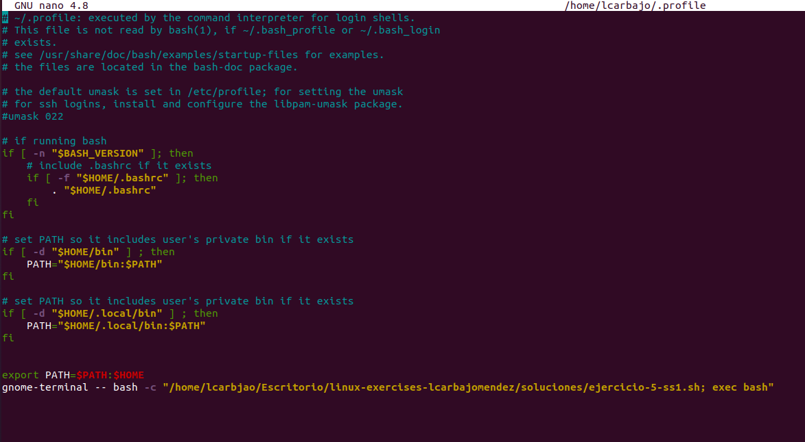
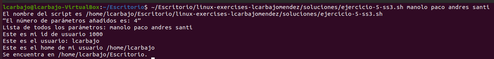

# Solución del Ejercicios 5

## 1. Crear un Shell Script

Crear un shell script que:

- Borre la pantalla
- Diga “Hola, nombre de usuario. La fecha actual es: .”
- Indique que estás en el “directorio actual”

En este script comenzamos con el comando `clean` permitiendo borrar todo lo anterior de la terminal. Luego, mostramos nuestro usuario `$USER` y la fecha actual `$(date)`, el primero nos permitirá ver el usuario en el que estamos actualmente y con la segunda expresión . Por último, para indicar que nos encontramos en el directorio actual usaremos el `$(pwd)`.

Aquí un ejemplo de la ejecución:

## 2. Hacer que el Script se Ejecute Siempre al Iniciar Sesión

Hacer que el script anterior se ejecute siempre cuando hagamos login con nuestro usuario.

Iniciamos con el comando `nano` para modificar nuestros archivos de inicio ya sea profile o bashrc y como última línea añadimos el comando `gnome-terminal -- bash -c` que nos abre una nueva terminal y ejecuta un comando concreto que será nuestro ejecutable.

## 3. Realizar un Script Informativo

Realiza un script que muestre:

- El nombre del script

    Para este punto usamos `$0`, variable que permite mostrar el nombre del propio script.

- El número de parámetros que se le pasan

    La variable centrada en mostrar el número de parámetros que se dan es `$#`.

- Una lista con los parámetros recibidos

    En este supuesto, usaremos `$@` mostrando todos los parámetros.

- El identificador del usuario que ejecuta el script

    Respecto al identificado usamos la variable `$UID`.

- El nombre de usuario

    Al igual que otros ejercicios para saber el nombre del usuario empleamos `$USER`.

- El directorio home del usuario

    Aplicaremos la variable de entorno `$USER`.   

- El directorio actual

    Como en el apartado uno, disponemos de `$(pwd)` ejecutando el comando y dando la información correspondiente al directorio actual.

