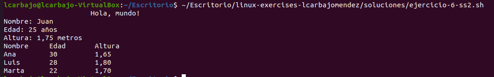
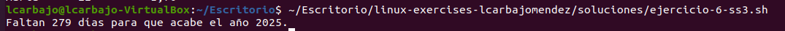

# Enunciados de Ejercicios 6

## 1. Leer Varias Variables del Teclado

> Al no coincidir la cantidad de valores que se ingresan por teclado con la cantidad de argumentos que necesita el script, ocurre algo peculiar. Si hay más argumentos que valores introducidos, a los argumentos sobrantes se les asigna `NULL` de forma automática. Si se introducen más valores que argumentos, los valores que sobran se le asignan al último argumento.

Ejercicio: Crea un script donde se lea con un solo comando `read` varios valores del teclado. Cada valor se introduce separado por espacios. El script debe esperar una cantidad fija de argumentos. Únelos todos en una variable única y muéstrala por pantalla. Varía la cantidad de valores introducidos para que sean menos, igual o más que la cantidad de argumentos que espera el script, para así verificar lo expuesto en el párrafo anterior.

 
## 2. Uso de la Orden Printf

Crea un script donde se use la orden `printf` (salida formateada) de 3 formas distintas.

El primer ejemplo mostramos la frase inicial en la programación siendo modificada con el `printf`añadiendo un formateo de espacios en blanco con `%-20s`. El segundo ejemplo, se usan tres variables y a cada una de esta se le dan un formato `%s` para el nombre, `%d` para la edad y `%.2f` para número decimales pidiendo dos solamente. El último ejemplo, nos muestra una tabla usando `%-10s` para ajustar la tabla de forma correcta.

## 3. Días Restantes Hasta el 31 de Diciembre

Crea un script que nos diga cuántos días quedan hasta el 31 de diciembre.

El funcionamiento es simple, estamos usando el comando `date`, concretando en `date +%j` adquiriendo el día del año en que estamos (por ejemplo el 30 de mayo es día número 150), luego precisamos el día del año deseado `-d»Dec 31`, para finalmente restarle el número del día actual con `date +%-j`, esto nos dará cuántos días faltan. Finalizamos, comentando el año a través de `date +%Y`.

