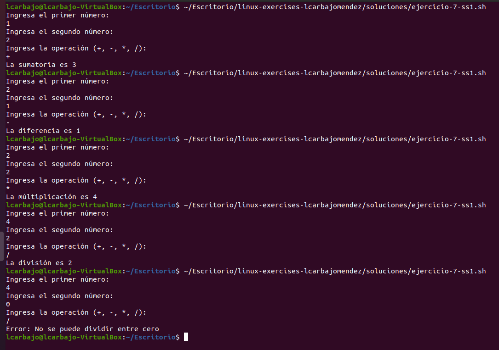
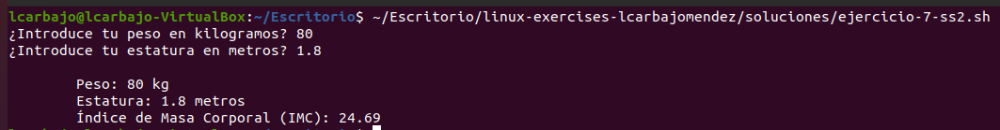
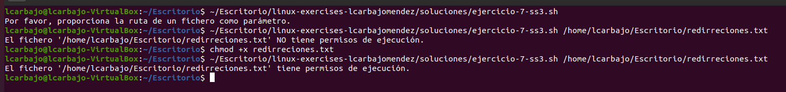

# Solución de Ejercicios 7

## 1. Calculadora Simple

Escribe una calculadora simple que permita al usuario ingresar dos valores numéricos y la operación: (`+`, `-`, `/`, `*`), y a continuación realice la operación introducida.

Con respecto a la realización de la calculadora, comenzamos ingresando los dos números deseados y leyéndolos con `read` y tras esto hacemos lo mismo con el símbolo de la operación deseada, la cual dependiendo de la respuesta hará la suma, resta, división o multiplicación todo en un bloque de `if` `elif` `else` donde acotaremos los casos. Tambień se controla en la división que en caso de que el número que vaya a dividir sea 0 no se pueda ejecutar esta.

## 2. Calcular Índice de Masa Corporal (IMC)

Realiza un script que solicite al usuario por teclado su peso y su estatura y muestre la siguiente salida por pantalla (respetando los saltos de línea y las tabulaciones): 

            Peso: [peso del usuario en kilogramos]
            Estatura: [estatura del usuario en metros]
            Índice de Masa Corporal (IMC): [Peso (kg)/ [Estatura (m)]2]

Comenzamos solicitando el peso en kilos y la altura en metros, realizamos el cálculo ayudándonos en primer lugar de `scale=2` que nos proporciona dos decimales y a travé de una tubería usamos el comando `bc -l`, dando el cálculo de forma correcta. Después mostramos el texto con las tabulaciones oportunas.

## 3. Crea un script que reciba como parámetro la ruta a un fichero y que nos indique si tiene permisos de ejecución.

El script deberá verificar que se ha introducido algún parámetro, y en el caso de que se haya introducido, verificar antes de comprobar los permisos que el fichero existe.

Verificamos si se ha añadido algún parámetro en la variable con el `-z`, en caso de ser correcto añadimos este parámetro a nuestra variable y comprobamos si no existe este archivo mediante `-e`. Una vez verificado ambos puntos, finalizamos verificando si posee archivos de ejecución con el `-x`.

