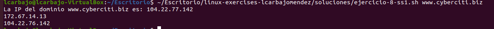

# Solución del Ejercicios 8

## 1. Mostrar la IP de un Dominio

Crea un script que pida al usuario introducir una dirección de internet por ejemplo: `www.cyberciti.biz`. A continuación muestra la IP de ese dominio. (Ayuda: hay un comando para consultar una dirección y obtener cierta información sobre la misma, incluída la IP).

Partimos de verificar si se ha añadido algún parámetro con `-z`. Obtenemos el ip de ese dominio que hemos pasado por parámetro a través de `dig +short` y lo mostramos por pantalla. 

## 2. Filtrar Procesos de Usuario

Crea un script que filtre los procesos de un usuario. Usar los comandos sobre procesos en ejecución en el sistema, vistos en la sección.
 
 Para este caso he dedicido realizar tres supuestos diferentes: EL primero es con el comando `ps -u` permitiendo la vista de los procesos del usuario. El segundo es `pstree` que nos lo muestra a modo de árbol. Por último con `top -u` se nos enseña a tiempo real, viene precedido de un `sleep 1` para que se vea la frase de lo que vamos a ver ahora.

