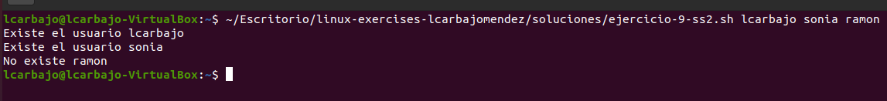

# Solución del Ejercicios 9

## 1. Creación de Usuarios y Grupos

Crea un usuario con el Id 999 y el nombre `navin`. 

Crea el grupo `oficina1`.

Cambia el nombre del grupo anterior a `oficina2`.

Crea usuario `sonia` en `oficina2`.

## 2. Crea un script que reciba como parámetros el nombre de uno o varios usuarios, y nos indique si existen en el sistema.

Crea un script que reciba como parámetros el nombre de uno o varios usuarios, y nos indique si existen en el sistema.
Consejo, utiliza el archivo `/etc/passwd` y realiza filtros con grep.

Empezamos verificando si se ha añadido algún parámetro y tras esto iteramos todos los usuarios pasados para filtrarlos con el `grep -q` que nos indica si existe o no.

