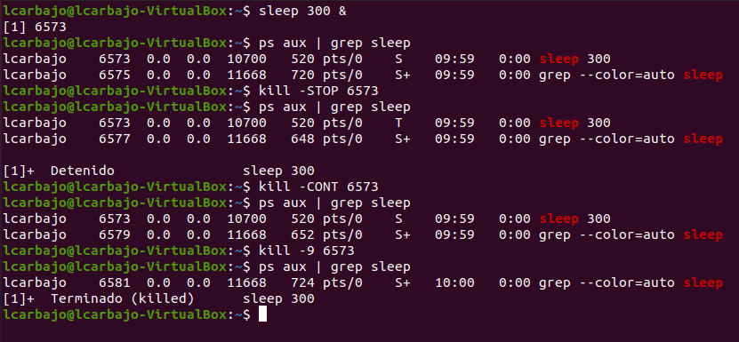

# Solución Extra 1- Gestión de Procesos del Sistema

## Objetivos
Familiarizarse con el uso de comandos para gestionar y monitorear procesos del sistema en Linux.

## Tareas

1. **Explorar el comando `ps`:**  
   Prueba diferentes opciones del comando `ps` para obtener información sobre los procesos del sistema. Investiga y ejecuta combinaciones como `ps aux`, `ps -ef`, entre otras.

   Como en algunos ejemplos anteriores se nos pedía información sobre procesos fui usando y familiarizando con algunos. Entre estos esta el `pstree` mostrado en mi ejercicio 8 que enseñaba los procesos de mi usuario en forma de árbol. Con `ps -aux` obtenemos una lista completa de los procesos en ejecución con detalles como el PID (Process ID), el usuario que ejecuta el proceso, el uso de CPU y memoria, el tiempo de ejecución, y el comando que inició el proceso.

    
   
   Con `ps -ef` logramos una lista completa de los procesos en ejecución con detalles como el UID (User ID), el PID (Process ID), el PPID (Parent Process ID), el tiempo de inicio, el tiempo de ejecución, y el comando que inició el proceso.

   

2. **Ejecutar y detener procesos:**  
   Ejecuta algún proceso (puede ser cualquier comando o programa que se mantenga en ejecución, como el notepad o la calculadora). Detén el proceso utilizando los comandos adecuados desde la terminal. Luego, vuelve a iniciarlo con comandos. Finalmente usa `kill` para terminar el proceso.

   En mi caso vi un ejemplo que usaba `sleep`, con este y una cuantía de tiempo observamos su PID con `ps aux | grep sleep`, aunque si añades al anterior un `&` también lo muestra. Tras ello usamos `Kill -STOP (PID correspondiente)` y lo detenemos, lo volvemos a iniciar con `Kill -CONT (PID correspondiente)` y lo finalizamos con `Kill -9 (PID correspondiente)`.

    

3. **Monitoreo en tiempo real:**  
   ¿Qué comando puedes utilizar para obtener información en tiempo real sobre los procesos en ejecución?
   El comando usado para monitoreo a tiempo real es top usado en mi ejercicio 8 también.

4. **Listado de procesos:**  
   Genera un listado, separado por comas, de todos los procesos cuyo nombre termine con la letra "a".
   Para ver todos los procesos usé `ps -e`, seguido de `grep $a` para buscar aquellos terminados en a, buscando en la cuarta columna donde se hallan los nombres con `awk '{print $4}'` y por último dando el formato de la separación por comas con `paste -sd,`. Todo ello separado por tuberías.

   
   