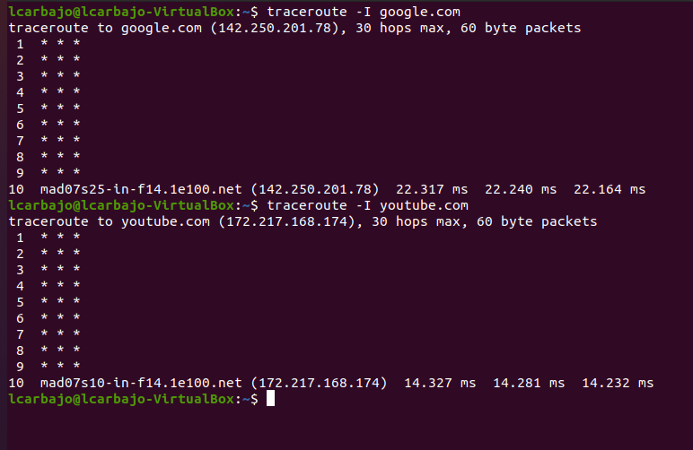
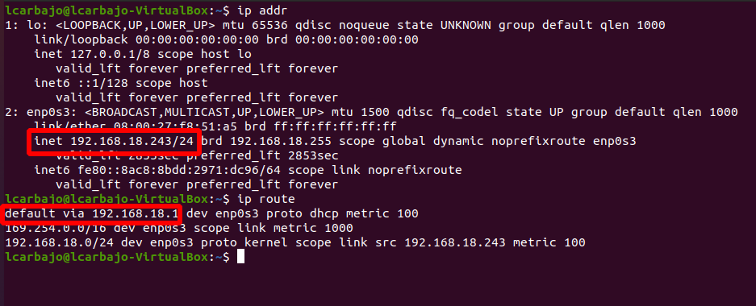

# Solución Extra 2 - Comandos de Red

## Objetivos
Familiarizarse con los comandos básicos de red en sistemas Linux (`ping`, `trace`, `ip`) y comprender su uso práctico para diagnosticar problemas de conectividad y analizar el estado de la red.

## Consideraciones
Elabora un informe breve con:
- Los resultados de cada comando.
- Las respuestas a las preguntas de cada sección.
  
Asegúrate de capturar pantallazos o registrar la salida de los comandos en un archivo que adjuntes en tu solución.

## Tarea

### 1. `ping` - Comprobación de conectividad
- Usa el comando `ping` para comprobar la conectividad entre tu máquina y una página web (la que tú quieras).
  
  **Preguntas**:
  - ¿Cuántos paquetes fueron enviados y recibidos?
  
  En mi supuesto, mandé paquetes a google siendo una cantidad de 62 paquetes trasmitidos y 61 recibidos,

  - ¿Cuál fue el tiempo de respuesta promedio?

  El tiempo promedio de todos ellos fue de 19.616 ms siendo la variable `avg` que nos encontramos cuando nos resume todos los datos.

  

  

### 2. `trace` - Trazado de ruta
- Usa el comando `tracepath` o `traceroute` para rastrear la ruta que sigue un paquete hasta la página web anterior. Luego prueba con una página web distinta que esté alojada en otro lugar.
  
  **Preguntas**:
  - ¿Cuántos saltos (hops) hay desde tu dispositivo hasta esas páginas web?
  
    En mi caso ambos comandos me han dado problemas, desconozco el motivo, pero finalmente tras varias pruebas el comando `traceroute` en su décimo salto ha conseguido conectarse. 

  - ¿Alguno de los saltos tiene una latencia particularmente alta?

    Al ser un solo salto posible desconozco si se ha dado una gran latencia en general o en alguno concreto.

    

### 3. `ip` - Información de configuración de red
- Usa el comando `ip` para obtener información sobre la configuración de tu red local.

  **Instrucciones**:
  - Ejecuta `ip addr` para obtener la lista de interfaces de red.
  - Ejecuta `ip route` para ver las rutas de red configuradas.
  
  **Preguntas**:
  - ¿Cuál es la dirección IP asignada a tu dispositivo?

    A través de `ip addr` podemos saber la dirección IP siendo precedida de la palabra inet siendo 192.168.18.243.
    
  - ¿Cuál es tu puerta de enlace predeterminada (default gateway)?

    Con `ip route` se nos muestra la puerta de enlace siendo precedida de un default siendo 192.168.18.

    