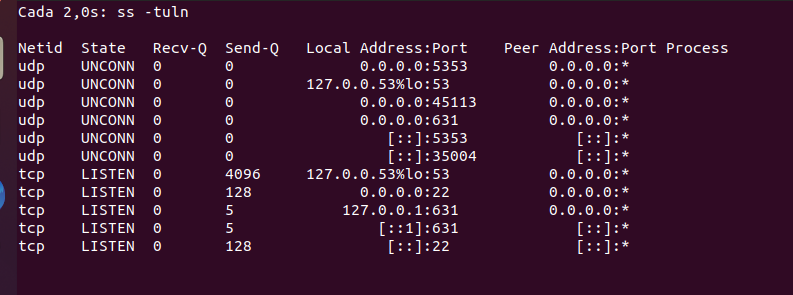

# Solución Extra 3 - Comando `ss`

El comando `ss` (Socket Stat) es una herramienta poderosa para inspeccionar las conexiones de red en Linux. Proporciona una visión detallada de las conexiones TCP, UDP, UNIX y más. Aquí tienes varios ejercicios y aplicaciones del comando `ss` para situaciones del mundo laboral.

---

## Ejercicio 1 - Mostrar todas las conexiones TCP activas

### Objetivo
Aprender a listar todas las conexiones TCP activas en el sistema.

**Instrucciones:**
- Ejecuta `ss -t` para listar las conexiones TCP activas.
- Identifica la dirección IP local y la dirección IP remota en cada conexión.

**Preguntas:**
- ¿Cuántas conexiones activas hay en tu máquina?
    En mi caso hay tres conexiones activas.
- ¿Cuáles son los puertos locales en uso?
    41326
    48986
    51900

### Aplicación laboral:
En un entorno de administración de servidores, esto es útil para monitorear las conexiones activas a un servidor de base de datos, aplicación web o servicio de correo.

Nos permite mantener el contro en la administración de servidores, ya que te permite monitorear las conexiones activas a diversos servicios pudiendo averigurar posibles situaciones negativas en nuestro rendimiento o incluso seguridad. Un ejemplo es una posible denegación de servicios ya que observamos que una misma IP esta relantizando el servidor de nuestra empresa.

---

## Ejercicio 2 - Mostrar puertos en estado de escucha (Listening)

### Objetivo
Determinar qué puertos están en estado de escucha en el servidor para identificar servicios activos.

**Instrucciones:**
- Ejecuta `ss -tuln` para listar los puertos TCP y UDP en estado de escucha.
- Filtra solo las conexiones TCP usando `ss -ltn`.

**Preguntas:**
- ¿Qué servicios están en estado de escucha en tu máquina?
     TCP: 53, 22, 631.
- ¿Qué puertos están abiertos?
    UDP: 5353, 53, 45113, 631, 35004.

### Aplicación laboral:
Como administrador de sistemas, esto es crucial para asegurar que solo los servicios necesarios estén escuchando en los puertos correctos, ayudando a reducir la superficie de ataque en un servidor.

Un caso posible se da cuando queremos comprobar que estamos conectados en puertos deseados o seguros, buscando una reducción de los daños para nuestras aplicaciones.

---

## Ejercicio 3 - Filtrar conexiones por puerto específico

### Objetivo
Aprender a filtrar conexiones por un puerto en particular.

**Instrucciones:**
- Usa `ss -t src :6443` para listar todas las conexiones donde el puerto fuente es 80 (puerto HTTP).
- También puedes buscar conexiones hacia un puerto específico, por ejemplo, `ss -t dst :6443` para filtrar las conexiones hacia HTTPS.

**Preguntas:**
- ¿Cuántas conexiones están usando el puerto 6443?
    Parece que en mi caso no existe ninguna conexión que use ese puerto.
- ¿Existen conexiones hacia el puerto 6443?
    Tampoco existen conexiones hacia ese puerto

### Aplicación laboral:
Este comando es útil en auditorías de seguridad y análisis de tráfico web para asegurarse de que el servidor esté manejando adecuadamente las conexiones HTTP y HTTPS.

Un posible ejemplo puede ser la monitorización o identificación de la conexión concreta con la finalidad de buscar un elemento extraño.

---

## Ejercicio 4 - Mostrar conexiones y procesos relacionados

### Objetivo
Visualizar los procesos relacionados con las conexiones de red activas.

**Instrucciones:**
- Ejecuta `ss -tup` para listar las conexiones TCP y UDP junto con los procesos responsables.
- Identifica el PID (ID de proceso) y el nombre del proceso asociado a cada conexión.

**Preguntas:**
- ¿Qué procesos están utilizando conexiones TCP activas?
    Me muestra que estaán usando conexiones TCP firefox y code (entiendo que es Visual Code).
- ¿Cuál es el nombre y PID del proceso responsable de la conexión?
    Nombre: firefox PID: 7086
    Nombre: code: PID: 3844

### Aplicación laboral:
Este comando es útil para diagnosticar problemas en un servidor, especialmente cuando necesitas identificar qué procesos están usando la red y asegurarte de que no haya procesos maliciosos en el sistema.

Con este comando podemos observar, aquellos procesos que usan la red pudiendo controlar aquellos que nos parezcan sospechosos.

---

## Ejercicio 5 - Estadísticas de conexiones

### Objetivo
Obtener estadísticas de las conexiones de red para medir el rendimiento y la estabilidad.

**Instrucciones:**
- Usa `ss -s` para obtener un resumen estadístico de las conexiones.
- Observa el estado de las conexiones (SYN-RECV, ESTAB, TIME-WAIT, etc.).

**Preguntas:**
- ¿Cuántas conexiones están establecidas (`ESTAB`)?
    Existen 2 conexiones establecidas.
- ¿Cuántas están en estado de espera (`TIME-WAIT`)?
    No existen conexiones a la espera.

### Aplicación laboral:
En monitoreo de red, este comando ayuda a diagnosticar problemas de conectividad o cuellos de botella en la red, especialmente en servidores con alta concurrencia.

Usando este comando podemos averiguar el motivo por el que nuestro sistema (por ejemplo en el ámbito bancario o de la salud) esta bloqueado o congestionado y poder poner remedio a ello.

---

## Ejercicio 6 - Monitoreo en tiempo real de conexiones

### Objetivo
Aprender a monitorear las conexiones de red en tiempo real.

**Instrucciones:**
- Ejecuta `watch ss -tuln` para monitorear en tiempo real las conexiones activas.
- Usa `watch ss -t src :443` para monitorear solo las conexiones HTTPS en tiempo real.

**Preguntas:**
- ¿Cómo cambia la lista de conexiones durante un período de tiempo?
    Cada 2 segundos se modifica a tiempo real las conexiones, modificando esta en el momento en el se da alguna conexión u servicio del sistema.
- ¿Qué tipos de conexiones se establecen y cierran con más frecuencia?
    Normalmente las conexiones más frecuentes son de HTTP/HTTPS o icluso alguna referente a bases de datos.

### Aplicación laboral:
Esto es útil en entornos de producción donde un administrador necesita supervisar las conexiones de red en tiempo real, detectar patrones inusuales o ver cambios a medida que los usuarios acceden a servicios.

Imaginemos que falla algún elemento del sistema y decidimos supervisar las conexiones a tiempo real, en este observamos un comportamiento extraño y a través de este comando descubrimo la conexión a un servicio dañino.

---

## Ejercicio 7 - Detectar conexiones sospechosas o no autorizadas

### Objetivo
Detectar posibles conexiones maliciosas en el sistema.

**Instrucciones:**
- Usa `ss -atp` para listar las conexiones TCP activas junto con los procesos responsables.
- Busca conexiones inusuales hacia IPs o puertos que no deberían estar activos.

**Preguntas:**
- ¿Existen conexiones hacia IPs o puertos sospechosos?
    En principio los puertos son normales como el domain(53), ssh(22) o ipp(631) o https(443).
- ¿Qué proceso está asociado a estas conexiones?
    Local Address:Port: 192.168.18.243:55334.
    Peer Address:Port: 52.182.143.215:https.
    Proceso: code (pid=3844, fd=18).

### Aplicación laboral:
En el ámbito de la seguridad informática, este comando es esencial para detectar conexiones no autorizadas o maliciosas en un servidor, lo que puede ser señal de una posible intrusión.

Con este comando podemos observar aquellas conexiones dudosas y eliminarlas posteriormente usando los datos que nos muestran como algún tipo de virus.

---

## Informe Final

Cada ejercicio debe ser completado con:
- Capturas de pantalla o salida de los comandos ejecutados.
- Respuesta a las preguntas propuestas.
- Observaciones personales sobre cómo los comandos podrían ser aplicados en situaciones reales de trabajo.

Este conjunto de ejercicios proporciona habilidades útiles para la administración de redes, servidores y seguridad informática, haciendo del comando `ss` una herramienta esencial en el día a día laboral.